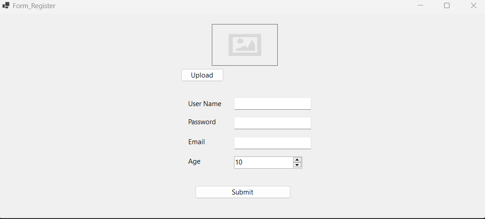
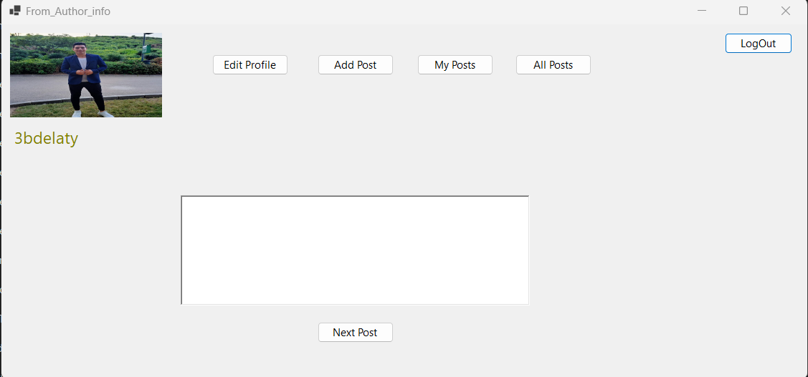
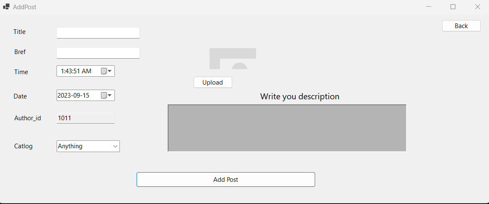
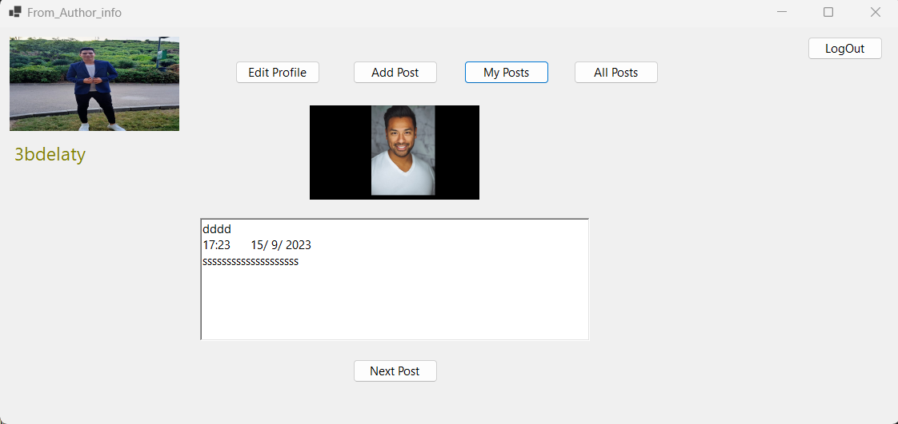
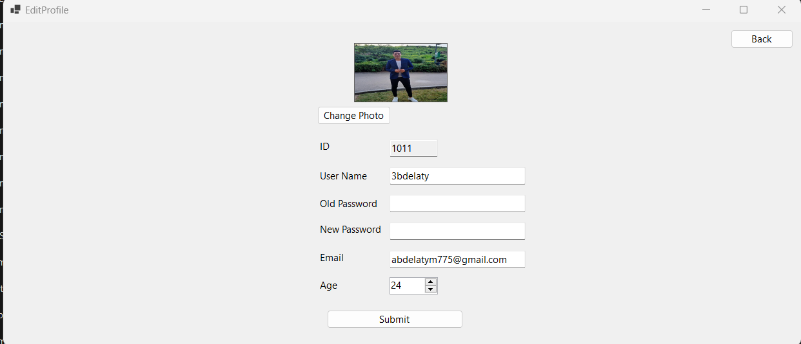

# Blogs_Posts-Project
## Descriptoin
The Windows Form Application - Social Media Platform is a full-fledged desktop application designed to provide users with a social media experience. The application leverages several key technologies, including C#, Entity Framework, SQL database, and LINQ, to offer users the ability to register, log in, create and manage posts, view their own posts and posts by others, and edit their profile. 

## Key Features
* User Registration and Login:

  Users can register by providing their username, email, and password.
  Registered users can log in using their credentials.
* Post Creation and Management:

  Logged-in users can create, edit, and delete their own posts.
  Each post includes a title, content, and timestamp.
* Viewing Posts:

  Users can view a feed of posts, including their own and those created by other users.
  Posts are displayed with titles, content, timestamps, and the username of the author.
* Profile Editing:

  Users can edit their profile, including changing their username, email, and password.
  Password changes are secure and follow best practices.
* Entity Framework:

  The application uses Entity Framework, a popular Object-Relational Mapping (ORM) tool in C#, to interact with the SQL database.
  Entity Framework simplifies database operations by mapping database tables to C# classes, making database interactions seamless.
* SQL Database:

  The application stores user information, posts, and other data in an SQL database.
  SQL databases provide reliability and efficiency in data storage and retrieval.
* LINQ Queries:

  LINQ (Language Integrated Query) is used to query the database and manipulate data.
  LINQ simplifies data manipulation, making it easier to retrieve, filter, and transform data.

## Screenshot:

